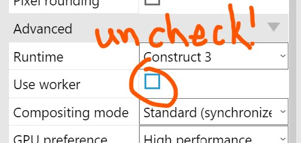

# Spine add-on for Construct 3

## Important notes for Spine export files:
- Requires Spine version 3.8+ JSON files. See Spine Formatter below to upgrade older JSON files.
- In the Spine export dialogue box, under Runtime, set both 'Filter min' and 'Filter mag' to Linear. 

Add-on based on **Mikal's** sample from this thread: 

[https://www.construct.net/en/forum/construct-3/general-discussion-7/spine-animation-js-template-145940 ](https://www.construct.net/en/forum/construct-3/general-discussion-7/spine-animation-js-template-145940) 

## Warning

To use this add-on you must uncheck "Project/Advanced/Use worker" option:

## Download

[Add-on](https://github.com/gritsenko/c3_spine_plugin/releases/download/v1.0.6/Spine-v1.4.6.c3addon)

[Sample project](https://github.com/gritsenko/c3_spine_plugin/releases/download/v1.0.5/SpinePluginTest.c3p)

## LIVE DEMO
[https://gritsenko.github.io/c3_spine_plugin/docs/LiveDemo/index.html](https://gritsenko.github.io/c3_spine_plugin/docs/LiveDemo/index.html)

## Spine Formatter (3.3+ to 3.8 JSON Format)
Useful for Dragon Bones Spine JSON export and earlier Spine versions.
[https://gritsenko.github.io/c3_spine_plugin/formatter/index.html](https://gritsenko.github.io/c3_spine_plugin/formatter/index.html)
