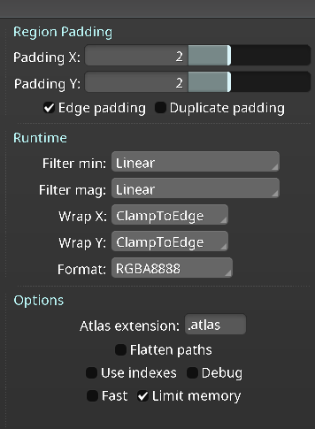

# Spine add-on for Construct 3

Please support development of the C3 Spine plugin:

## Important notes for Spine export files:
- Requires Spine version 3.8+ JSON files. See Spine Formatter below to upgrade older JSON files.
- In the Spine export dialogue box, under Runtime, set both 'Filter min' and 'Filter mag' to Linear or Nearest.
- In the Packing settings, set Region Padding to 2 or higher (if you see lines around your images, it may be because padding is set to 0).
- Max texture size, 4096x4096. multiple texture sheets supported (use comma separated list on C3 spine object's png path property).

## Additional Spine project guidelines:
- Do not use minify on export of C3 project.
- Do not use worker mode for C3 (see below for details.)
- For jumping or large movments, animate Spine character 'in place', don't do large translations in the Spine project.
- Use C3 events and movement to do the large translations in the C3 project instead (e.g. a long jump.)
- If animation is clipping against the bounds of the C3 object, you can use the scale property to make the Spine render smaller
- Alternatively create a large transparent image in the Spine project behind your Spine character, this will can be used to set the bounding box size fot the C3 spine render.

## Multiple instances of a C3 Spine Object
- Each C3 Spine Object (not instance), should load only one skeleton and only one atlas.
- Other instances of the Spine Object must use the same skeleton and atlas, but can use different skins.
- This new change reduces the size of the texture memory required for multiple instances of the same skeleton.

## Set region action
- This action changes the current region texture on the skeleton/slot/placeholder of the current skin of the skeleton to a new region in the loaded atlas. All other instances of the same skeleton/skin will also change. This can be useful for customizing skins. Using skins is the typical way to do this.

## Custom skins
- Runtime skins can be created, using *Create custom skin*, *Add custom skin* and *Set custom skin*.

## Slot color/dark color
- Slot color can be set through *Set slot color* and *Set slot dark color*. The colors are applied using *Apply slot colors*. The slot colors will be reverted if a new skin is applied or if the Spine animation changes the slot colors. To reset the slot colors to the original colors, use *Reset slot colors*. Dark color will only be applied if 'Tint Black' is enabled for the slot in the Spine project.

## Render quality
- This sets the resolution of the texture to render to. Lower quality requres less texture memory and GPU performance.

## Share your C3 and Spine plugin work!
- Tweet your work @kindeyegames , @pix2d and #construct3, we'd be happy to see your work!

Add-on based on **Mikal's** sample from this thread: 

[https://www.construct.net/en/forum/construct-3/general-discussion-7/spine-animation-js-template-145940 ](https://www.construct.net/en/forum/construct-3/general-discussion-7/spine-animation-js-template-145940) 

## Downloads
[Add-on](https://github.com/gritsenko/c3_spine_plugin/releases/download/1.16.3/Spine-v1.16.3.c3addon)

[Previous Add-on Versions](https://github.com/gritsenko/c3_spine_plugin/tree/master/dist)

[Sample project](https://github.com/gritsenko/c3_spine_plugin/releases/download/1.5.0/SpinePluginTest.c3p)

[MixandMax project](https://github.com/gritsenko/c3_spine_plugin/releases/download/1.13.0/SpineMixandMatch.c3p)

## LIVE DEMO
[https://gritsenko.github.io/c3_spine_plugin/docs/LiveDemo/index.html](https://gritsenko.github.io/c3_spine_plugin/docs/LiveDemo/index.html)

## Spine Formatter (3.3+ to 3.8 JSON Format)
Useful for Dragon Bones Spine JSON export and earlier Spine versions.
[https://gritsenko.github.io/c3_spine_plugin/formatter/index.html](https://gritsenko.github.io/c3_spine_plugin/formatter/index.html)

## Current supported features
- Load Spine json, atlas and pngs.
- Select starting skin, skeleton, animation
- Dynamically set existing skin defined in JSON
- Mesh Deformations
- Animation set, play, pause, trigger on animation complete.
- Animation set time, play from beginning, current time, current ratio.
- Animation finished, animation playing conditions.
- Default mix interval for blending animations.
- Dynamic animation speed control.
- Dynamic region changing for current skin attachments.
- Events to trigger C3 triggers.
- Render Quality property (upsample, downsample rendered image, improve quality vs save on GPU performance and texture memory.)
- Add expressions TextureWidth, TextureHeight (texture size used to display Spine), based on original Spine bounds and RenderQuality setting.
- Multiple skeleton instances (w/ variable skin) per Spine object (save on atlas texture memory usage and faster to spawn new instances.)
- Batch render for improved performance with multiple Spine instances and objects.
- Multiple atlas pages (multiple pngs).
- Mix and Match skins, custom runtime skins.
- C3 worker mode support.
- Color/Dark Color for Slot at runtime.

## Wishlist
- Preview Spine render in editor (dependent on C3 editor SDK updates)
## Release notes
- 1.16.3 Add updateWorldTransform on animation set.
- 1.16.2 Change behavior of *Set Animation w/ starting time* to not trigger events if the events were before the starting time.
- 1.16.1 Bug fix for slot color (handle reset and new skin properly, only apply dark color if Tint Black is set in Spine project for slot).
- 1.16.0 Add Set slot dark color, Apply Slot color, Reset Slot color. Add Set animation time and starting point of Set animation (beginning, current time, current ratio). Deprecated set color attachment (did not support dark color).
- 1.15.2 Add project sampling support to Spine C3 texture.
- 1.15.1 Fix pixel rounding bug.
- 1.15.0 Set Slot Color (temporary until new skin set), [*deprecated* Set Custom Color Attachment] Fix one frame animation bug.
- 1.14.1 Fix PMA bug regression (introduced in 1.11.0)
- 1.14.0 Add C3 worker mode support.
- 1.13.0 Add runtime create skin and add skin ACEs and MixandMatch example project.
- 1.12.1 Change path separator to comma instead of space to match existing skin paths separator.
- 1.12.0 Add support for Atlas pages (multiple png, space separated), finish implmention of Set Attachment action, fix webgl1 support (revealed on iOS w/o weblg2 enabled.)
- 1.11.2 Move spineBatcher.init() to prevent race condition (seen on iOS)
- 1.11.1 Remove spine instance from batcher when C3 Spine instance calls Release() (e.g. C3 object destroyed.)
- 1.11.0 Implement batch render for improved performance with multiple Spine objects and instances.
- 1.10.0: Add Keep Aspect Ratio checkbox
- 1.9.0: Change spine-webgl.js to external script rather than including in C3 DOM script on export.
- 1.8.0: Instances of a spine object will use the original objects skelton info, reducing texture requirements and faster creation of an instance. Add render quality property. Add TextureHeight and TextureWidth ACEs.
- 1.7.0: Add event trigger ACE (trigger when animation event occurs.)
- 1.6.0: Add Set region action (change region(texture) of an attachment in a slot on the current skin. Useful for character customization.
